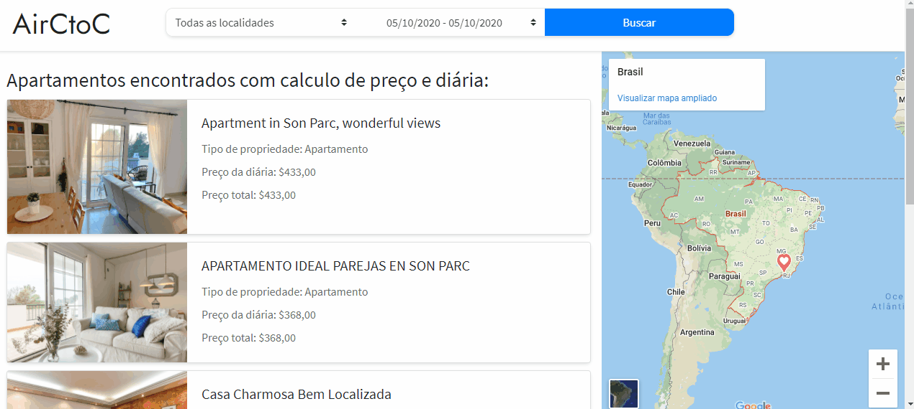

Check this app online: [airctoc](https://airctoc.netlify.app/#)

## 🚢 AirCtoC

AirCtoC is a simulation of the [Airbnb](https://www.airbnb.com.br/), a popular site to rent rooms.
This project was created for the second challenge of the Gama Academy Hiring Coders 2020.

### 💻 Technologies
This project was developed using Vanilla.js, Bootstrap, HTML, CSS.

**Libraries and packages:** 
**js fetch:** Making external calls to APIs. 
**google maps:** Used to display google maps by iframe. 

### ⚖ LICENSE
The project can be copied and modified, as long as due credit is given.
